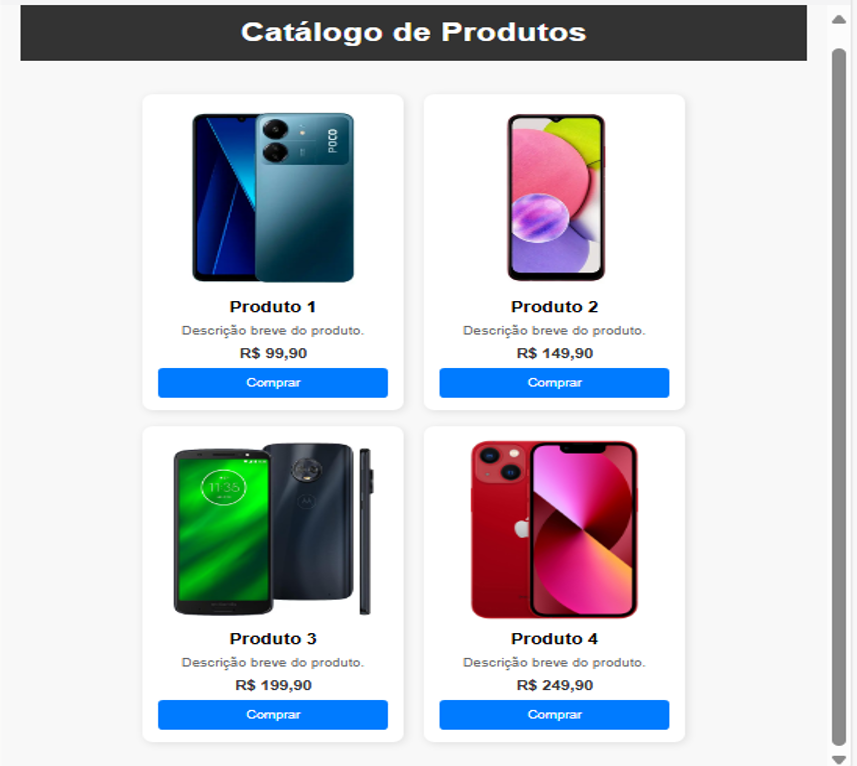

### **🎯 Exercício Prático Avançado: Catálogo de Produtos com Flexbox**  

**Objetivo:** Criar um **catálogo de produtos responsivo** usando **Flexbox**. O layout deve ser organizado, com espaçamento adequado e uma aparência profissional.  

---

### **📌 O que vamos fazer?**  

✔️ Criar um **catálogo de produtos** organizado em "cards".  
✔️ Os produtos devem se alinhar **automaticamente** na tela, sem precisar de `media queries`.  
✔️ Os cards terão uma **imagem, título, descrição e botão de compra**.  
✔️ **Flexbox** será utilizado para alinhar os elementos e distribuir os produtos dinamicamente.  

---

### **1️⃣ Estrutura do HTML**  

Crie um arquivo `index.html` e adicione:  

```html
<!DOCTYPE html>
<html lang="pt">
<head>
    <meta charset="UTF-8">
    <meta name="viewport" content="width=device-width, initial-scale=1.0">
    <title>Catálogo de Produtos</title>
    <link rel="stylesheet" href="styles.css">
</head>
<body>
    <header>
        <h1>Catálogo de Produtos</h1>
    </header>
    <main class="container">
        <div class="card">
            
            <h2>Produto 1</h2>
            <p>Descrição breve do produto.</p>
            <span>R$ 99,90</span>
            <button>Comprar</button>
        </div>
        <div class="card">
            
            <h2>Produto 2</h2>
            <p>Descrição breve do produto.</p>
            <span>R$ 149,90</span>
            <button>Comprar</button>
        </div>
        <div class="card">
            
            <h2>Produto 3</h2>
            <p>Descrição breve do produto.</p>
            <span>R$ 199,90</span>
            <button>Comprar</button>
        </div>
        <div class="card">
            
            <h2>Produto 4</h2>
            <p>Descrição breve do produto.</p>
            <span>R$ 249,90</span>
            <button>Comprar</button>
        </div>
    </main>
</body>
</html>
```

---

### **2️⃣ Estilização com Flexbox**  

Crie um arquivo `styles.css` para estilizar os produtos com **Flexbox**:  
Sintam-se à vontade para personalizar cores, imagens e bordas conforme desejarem, desde que sigam fielmente o layout do protótipo abaixo. 😁
---
### **3️⃣ Prototipo da estilização**  



---

### **📌 O que você aprendeu?**  

✅ `display: flex;` para alinhar os produtos lado a lado.  
✅ `flex-wrap: wrap;` para ajustar os produtos automaticamente na tela.  
✅ `gap: 20px;` para espaçar os elementos de forma uniforme.  
✅ `justify-content: center;` para centralizar os itens na página.  

💡 **Agora é sua vez!** Personalize cores, fontes e adicione mais produtos! 🚀