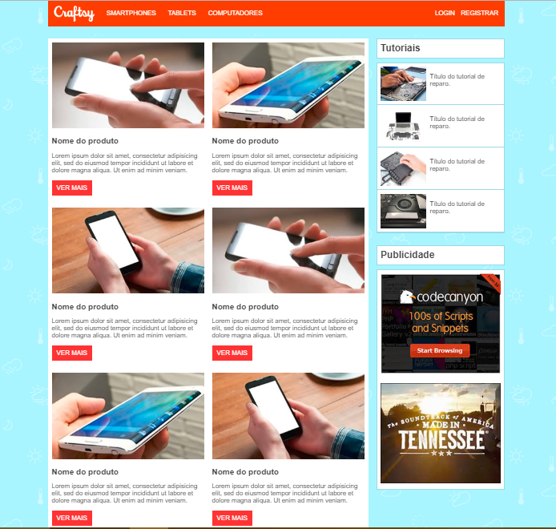
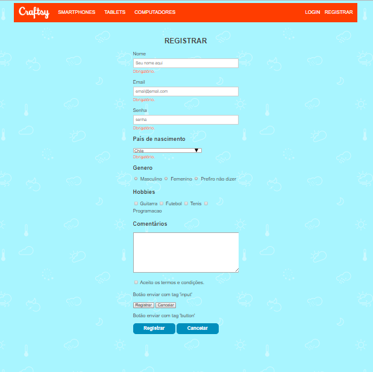
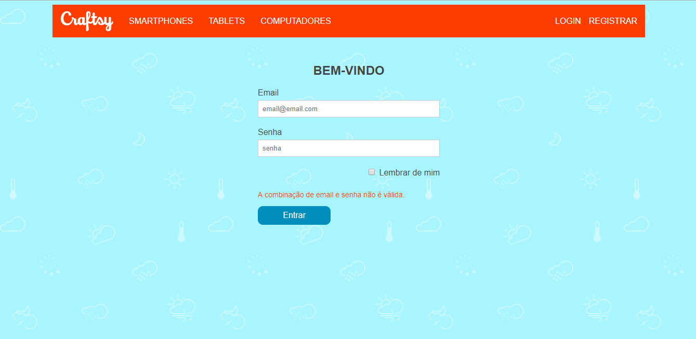

# 📱 Projeto: Site de Curso de Manutenção de Celular, Tablet e Notebooks

## 🎯 Objetivo

Fala, galera! O desafio agora é desenvolver um site para um curso de manutenção de dispositivos eletrônicos, aplicando tudo o que aprendemos até agora. A ideia é seguir à risca a estrutura do projeto definida no PDF `craftsy-blended-mockups` e utilizar as imagens `home-craftsy`, `login-craftsy` e `registrar-craftsy` como referência para o layout. Bora codar com organização e qualidade! 🚀

## 🗂️ Estrutura do Projeto

Vamos manter a arquitetura dos arquivos bem organizada. Cada elemento deve estar no seu devido lugar:

- **`/assets`** → Aqui vão as imagens, ícones e outros arquivos estáticos.
- **`/css`** → Arquivos de estilos (lembrando de usar variáveis para manter um padrão de cores e espaçamentos).
- **`/pages`** → Se houver páginas internas, organizamos aqui.
- **`index.html`** → Nossa página principal (Home).

## 🎨 Layout & Design

O design deve seguir os espaçamentos e posicionamentos indicados no `craftsy-blended-mockups`. Fiquem atentos aos seguintes pontos:

- Utilizar **CSS organizado** e, se possível, separar estilos em arquivos modulares.
- Responsividade é essencial! O site precisa ficar bonito tanto no desktop quanto no mobile.
- Atenção à tipografia e cores para manter a identidade visual do curso.

## 🛠️ Tecnologias Utilizadas

- **HTML5** → Estrutura do site
- **CSS3** → Estilização e responsividade

## 🖼️ Referências Visuais

### Home

### Registro

### Login

## 👪 Time DEV
O time de desenvolvimento poderá ter até três Participantes.

## 📅 Prazo de Entrega
 
O projeto deve ser entregue até o **dia 25/04/2025**. Então, sem enrolar! Qualquer dúvida, bora trocar ideia e resolver juntos. 😃

## 🚀 Bora codar!

Esse é o momento de colocar em prática tudo que aprendemos. Organizem bem os arquivos, sigam as diretrizes e caprichem no layout! Qualquer dúvida, estamos aí para ajudar. 💡💻

